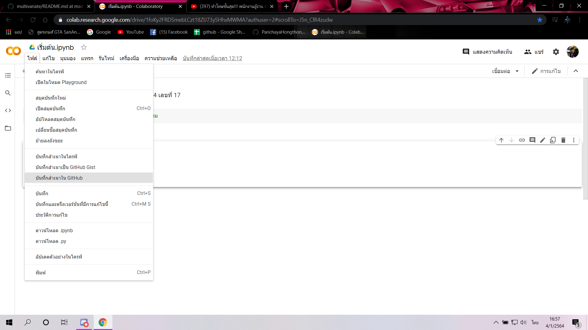
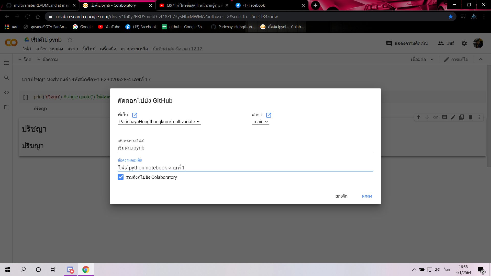

# multivariate

### ปริชญา หงส์ทองคำ 623020528-4

.md => makedown

[ ]  square brackrts

( ) parentheses

อธิบายการใช้งาน Github และ Google Colab ว่าหน้าที่แต่ละอันคืออะไร และอธิบายวิธีเซฟไฟล์จาก Google Colab ลงใน Github

## Github
คือ แหล่งรวมไฟล์โค้ดที่เราสามารถแชร์ให้คนอื่นสามารถเข้ามาแก้ไขหรือดูโค้ด

## Google Colab
คือ หน้าต่างในการเขียนโค้ด

## การเซฟไฟล์จาก Google Colab ลงใน Github
คือ **1.File 2.บันทึกสำเนาใน Github 3.ตั้งชื่อไฟล์ 4.comment 5.เสร็จ

![ วิธีเซฟไฟล์ google colab(ไฟล์.png)]

